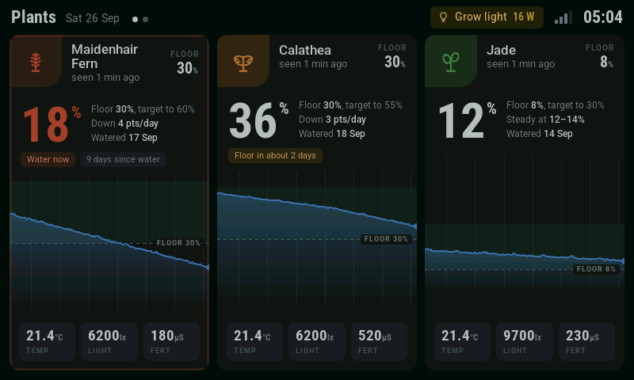
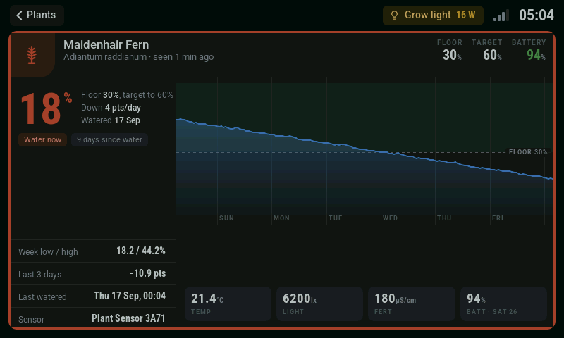
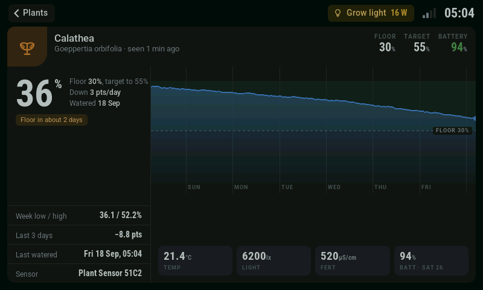
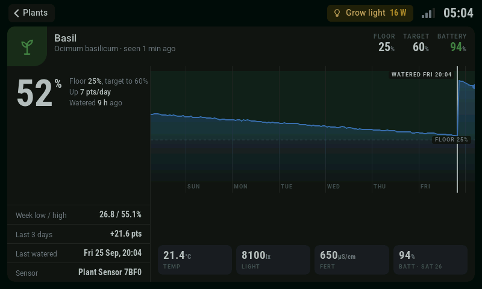
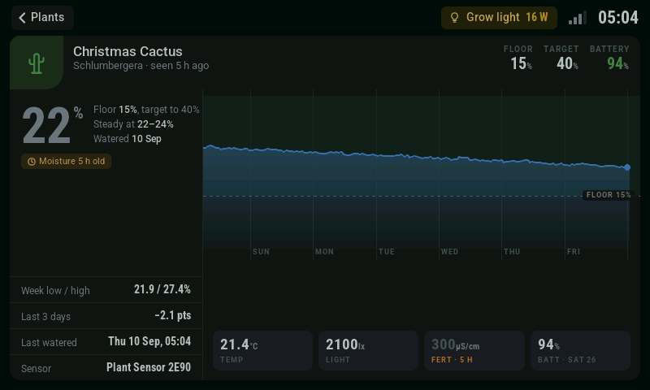
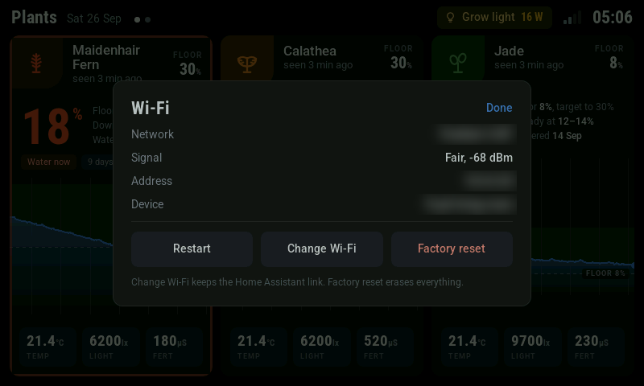
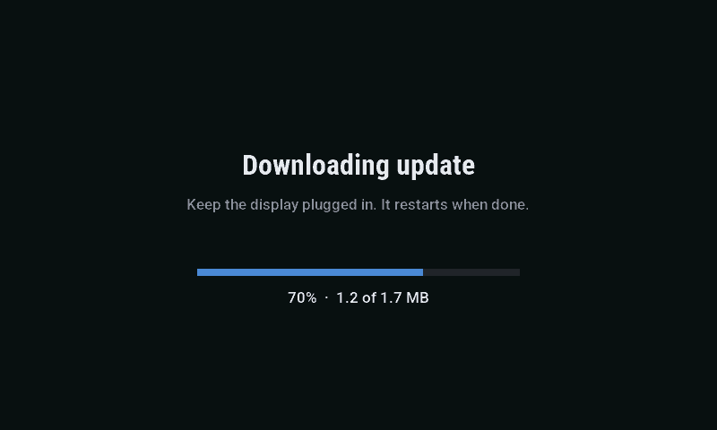

# FireLabs Plant Display

Firmware for a wall or shelf display that shows your plants from Home Assistant: moisture, trend, a week of history, and who needs water first.

It runs on the Waveshare ESP32-S3-Touch-LCD-4.3 (800x480, touch). The display checks in with Home Assistant over a webhook once a minute and gets back everything it draws, so there's nothing to configure on the device beyond Wi-Fi.

## Screenshots

Captured straight from the panel's frame buffer, with sample plants.



| | |
|---|---|
|  |  |
| Below its floor | Falling, floor in about two days |
|  |  |
| Watered last night | Sensor quiet for five hours |
|  |  |
| Wi-Fi and resets | Updating over Wi-Fi |

## What it shows

- An overview of three plants per page, sorted by need. Swipe or tap the page dots for more, and it comes back to page one after a minute.
- A detail screen per plant, with the reading, the trend, the moisture band and a seven-day curve.
- A red pulsing border on any plant that needs water now.
- The grow light, if you have one: tap it to toggle the light.
- Wi-Fi signal bars. Tap them for the network details, Restart, Change Wi-Fi (keeps the Home Assistant link) and Factory reset.

From Home Assistant you get a backlight switch, brightness, and auto-dim for when it's mounted somewhere it should go quiet. With a grow light configured, the screen can follow the light and sleep when it's off; a touch wakes it without opening anything.

## What you need

- A Waveshare ESP32-S3-Touch-LCD-4.3
- Home Assistant with [firelabs-hass](https://github.com/FireBall1725/firelabs-hass), and ideally [plants-hass](https://github.com/FireBall1725/plants-hass), which the display reads plants from

## First install

The first flash goes over USB, through the port labelled **UART**. On this board the flasher can't put the chip into download mode by itself, so hold **BOOT**, tap **RESET**, and let go of **BOOT** before uploading:

```
pio run -e pd -t upload
```

Tap **RESET** again when it finishes. The display then offers a Wi-Fi network called `FireLabs PD` followed by six characters. Join it from your phone, pick your Wi-Fi, and the display restarts onto your network.

Home Assistant finds the display on your network and offers to set it up (or add the FireLabs integration and enter its address). Pick the plants to show. Setup gives you a check-in URL: open the display's address in a browser and paste it there.

## Updates

After the first flash, updates come from Home Assistant: the display's firmware entity offers each new release of this repository, and Install sends it over Wi-Fi. The display downloads the whole image into memory, then installs it, with a progress screen for both steps.

To install a specific build, use the `firelabs.install_firmware` action with a URL or a file in your Home Assistant config folder.

## Building

```
pio run -e pd          # release build
pio run -e pd-debug    # adds request logging and the /api/debug routes
pio run -e demo        # fixed sample plants, no Wi-Fi, for checking the screens
```

Three things in this build are load-bearing:

- The platform is pinned to pioarduino 53.03.13. Stock PlatformIO's espressif32 can't build it.
- `custom_sdkconfig` makes pioarduino rebuild the framework, which takes a few minutes the first time. It sets a larger data cache (without it the screen flickers) and pins the stock Arduino values that the rebuild would otherwise drift from.
- `scripts/gdma_iram_ld.py` puts the DMA control functions in IRAM. The rebuild doesn't regenerate its linker script, so the matching sdkconfig option is ignored, and without the script every firmware update crashes the display mid-install. CI fails the build if any of them end up in flash.

## Fonts

The UI uses glyphs converted from Roboto (Copyright 2011 The Roboto Project Authors, SIL Open Font License 1.1) and Roboto Condensed (Copyright 2011 Google Inc., Apache License 2.0).

## Support

Questions, updates, and works in progress: [FireBall Codes on Discord](https://discord.gg/QpV82CFfVD).

If this saved you some time, you can [buy me a sushi roll](https://ko-fi.com/fireball1725).

## Licence

AGPL-3.0-only. Copyright (C) 2026 FireBall1725.
